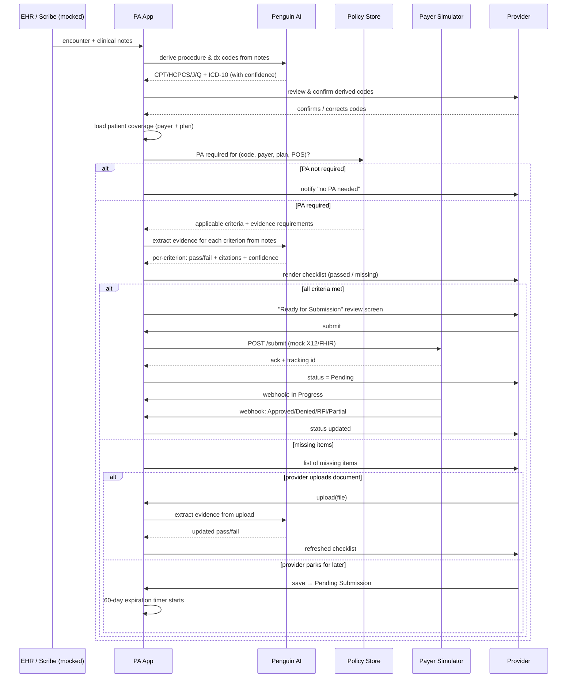
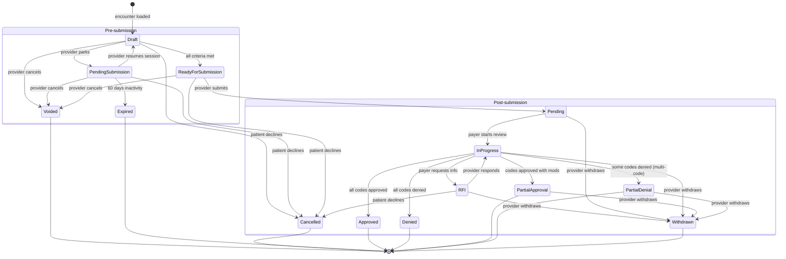

# Workflow & State Machine

This document defines the end-to-end PA flow, the full state model with every transition, and the behavior of the status simulator that stands in for the payer side.

## End-to-end flow (provider perspective)

## State machine

## State definitions

### Pre-submission

| State | Meaning | Auto-triggered? | Visible in work queue? |
|---|---|---|---|
| `Draft` | System is actively assembling the PA, or provider is in an active session reviewing the checklist | Yes (entry state) | No |
| `Pending Submission` | Provider parked the PA — items missing, will return later | No | Yes (parked queue) |
| `Ready for Submission` | All criteria passed; awaiting provider's submit click | Yes (when criteria all green in Draft) | Yes (action queue) |
| `Voided` | Provider cancelled before submission (changed mind, ordered something else) | No | No (terminal) |
| `Cancelled` | Patient no longer needs the service | No | No (terminal) |
| `Expired` | Pending Submission auto-expired after 60 days of inactivity | Yes (timer) | No (terminal) |

### Post-submission

| State | Meaning | Auto-triggered? |
|---|---|---|
| `Pending` | Submitted; payer has not started review | No (set on submit) |
| `In Progress` | Payer reviewer has started | Yes (simulator) |
| `RFI` | Payer is requesting more information | Yes (simulator) |
| `Approved` | All codes approved by payer | Yes (simulator) |
| `Denied` | All codes denied by payer | Yes (simulator) |
| `Partial Approval` | Codes approved, but with modified frequency / duration / dose | Yes (simulator) |
| `Partial Denial` | Multi-code PA where ≥1 code is denied but not all | Yes (simulator) |
| `Withdrawn` | Provider pulled back a submitted PA before the payer decided | No (provider action) |

### Terminal states
`Voided`, `Cancelled`, `Expired`, `Approved`, `Denied`, `Partial Approval`, `Partial Denial`, `Withdrawn`. PAs in terminal states are read-only.

### Notes on payer-side expiration
PAs themselves expire on the payer / UM side (e.g., approved PA valid for 90 days). We display this expiration but don't drive it. The 60-day expiration timer mentioned above is **provider-side** and applies only to the `Pending Submission` pre-submission state — it represents "this PA was held by the provider too long without action."

## The "upload-and-recheck" loop

This is the core interaction pattern when criteria are missing.

1. Checklist shows N missing criteria, each with a description of what evidence is needed.
2. Provider clicks "Upload" on a missing item — drag-drop file or paste text.
3. App stores the upload, links it to the PA.
4. App re-runs evidence extraction across **all** criteria (not just the one the upload was associated with — uploads may satisfy multiple criteria).
5. Checklist re-renders with updated pass/fail and citations to the new upload.
6. If all green: status auto-transitions Draft → Ready for Submission.
7. If still missing items: provider can upload more or click "Save for later" → Pending Submission.

Why re-run all criteria? Real PA criteria often overlap — a single H&P note can satisfy "diagnosis documented" and "duration of symptoms" and "conservative therapy attempted" simultaneously. Targeted re-checks miss these overlaps.

## Eligibility & coverage step

After codes are confirmed and before policy lookup:

1. Pull patient coverage record from seeded data (in production: 270/271 EDI or FHIR Coverage resource).
2. Resolve to a specific (`payer`, `plan`, `benefit_category`) tuple.
3. Use that tuple — plus the procedure code(s) and place of service — to query the policy store for PA requirements.

Why this matters: same CPT code may need PA on one plan and not another, or in one site of service and not another. The lookup key has to include all of these.

## Status simulator behavior

The simulator is a small in-process service (or scheduled job) that drives post-submission status transitions on a configurable timeline. It does **not** make real network calls.

Default schedule (configurable per scenario):

| From | To | Delay (configurable) |
|---|---|---|
| Pending | In Progress | 30 seconds |
| In Progress | (terminal) | 90 seconds |

Outcome distribution per scenario is scripted, not random. The Head CT scenario always lands on Approved. The Knee MRI scenario always lands on Approved (after the upload-and-recheck loop pre-submission). The Botox scenario always lands on RFI on first pass, then Approved after provider responds.

Demo aid: a "fast-forward" button on the tracker page accelerates the timer to ~3 seconds per transition. There's also a manual "force transition" admin action for live demos that go off-script.

## Audit trail

Every state transition, every AI decision, every document upload, and every provider action is logged with:
- timestamp
- actor (provider id or `system`)
- pa id
- previous state, new state (if applicable)
- evidence (which criterion changed, which document was attached, etc.)
- AI confidence + model version (if AI-driven)

This is a regulatory-grade pattern even though the hackathon doesn't enforce regulatory requirements. It also gives us a debug trail for evaluating AI accuracy.

## Provider work queues

The app surfaces queues to the provider home screen:

- **Action needed** — `Ready for Submission`, `RFI`
- **Parked** — `Pending Submission` (with days-until-expiration badge)
- **In flight** — `Pending`, `In Progress`
- **Recently completed** — terminal states from the last 30 days

Each queue is a filtered view over the same `PriorAuth` table, ordered by most recent state change descending.
